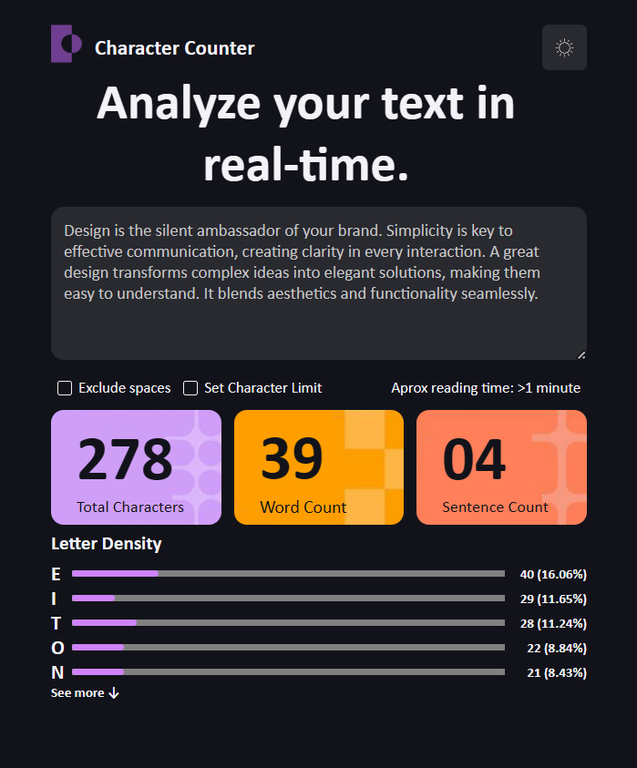

# Trabajo N°1 de UTN Desarrollo Web
## Agustina Moya Vellio
---
### Objetivo del proyecto:
Replicar la interfaz UI con HTML y CSS como si fuera un componente. Los valores son estáticos.

### Tecnologías Utilizadas:
- HTML5
- CSS3
- README
- Git
- GitHub
- Markdown (readme)
- Google y https://developer.mozilla.org/es/
- ChatGPT para dudas de código
### Organización de HTML:
Organicé el HTML en base a etiquetas que tuvieran coherencia semántica. Ej: Utilicé 'div' para dividir secciones y poder alinearlas correctamente y 'label' para elementos que tuvieran interacción A su vez, utilicé TAB para darle jerarquía al código. Utilicé 'class' para luego editar de manera individual partes del proyecto.
Tengo mi body, header, hero, main, sección de imágenes y sección de "Letter density".
### Resolución del CSS:
Comencé con el código de "mayor a menor" para las etiquetas. Utilicé estilos particulares para cada sección y globales para el archivo completo. Utilicé 'class' para editar de manera individual cada parte necesaria del proyecto. Usé flexbox, hover, ::propiedades activas y webkit.
### Inconvenientes:
- Alinear 'progress' al contenido de "Letter Density" 
- La personalización de checkboxes y de progress
- Me costó construir el Readme
- La parte de Hero no sabía cómo darle un buen ancho a mi h1

## Capturas de pantalla del trabajo:

